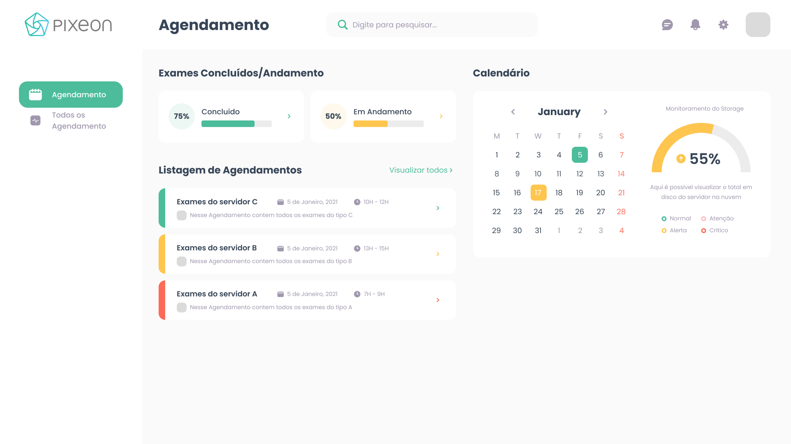
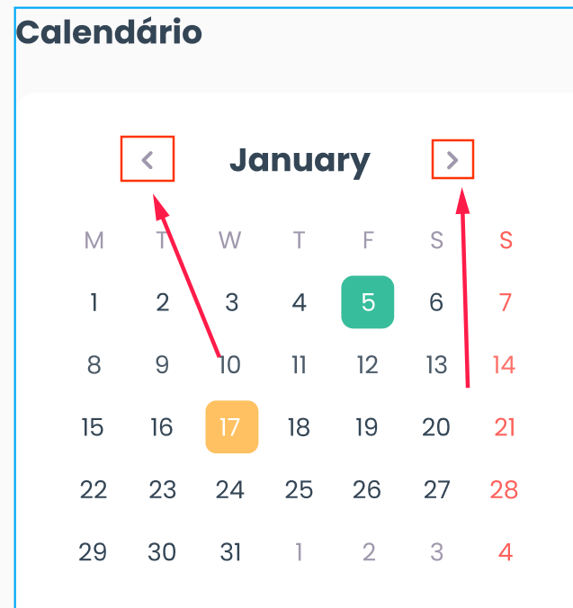

# frontend-challenge

Esse desafio tem por objetivo avaliar sua capacidade de ser criativo. Queremos conhece-lo melhor, conhecer suas habilidades em desenvolvimento, não focando em uma linguagem mas passando em formato de código sua personalidade, sua vontade de aprender, inovar e sua capacidade de resolver um problema.

Mantenha em mente que esse desafio será analisado por outros desenvolvedores. É necessário (dependendo da solução que desenvolva) que haja uma documentação de como executar essa sua aplicação. Disponibilize esse desafio em um repositório git com todo o código necessário, assim como a documentação de como executar a aplicação em um arquivo `README.md`.

Nesse teste nosso intuito não é que você passe horas e horas desenvolvendo e não tire nenhum proveito, queremos que além de abrir uma oportunidade seja um aprendizado de coisas novas e empolgantes.

### O que iremos avaliar?

- A estrutura e organização do projeto.
- A qualidade de escrita do código JS.
- A escrita do código CSS.
- O entendimento das regras para a implementação da tela.
- Sua capacidade criativa

## Desafio

O desafio será implementar essa tela abaixo. Para visualizar use o figma, acesse nesse [link](https://www.figma.com/file/4IobUQPUE0HhTDvXXScGbz/frontend-challenge?node-id=0%3A1). 

> Para visualizar as propriedades dos elementos é necessário que realize o login no figma.
> 

### Regras

- Não utilize bibliotecas de estilização como bootstrap, tailwind css, etc...
- A aplicação terá que ser escrita utilizando React, caso queira implementar utilizando o NextJs, será considerado como um plus.
- Para a escrita dos CSS, utilize o [styled-components](https://styled-components.com/) e para os ícones utilize o [styled-icons](https://styled-icons.dev/).
- O calendário não precisa ser dinâmico, pode escolher qualquer mês e deixar fixo, mas toda a parte de estilização deverá ser seguida. Não precisará ter ação para navegar entre os meses (botões indicados pelas setas), iremos avaliar o seu domínio com o CSS.
    
    
    
    Os dias do mês deverão seguir o mês escolhido, Dica: Utilize a biblioteca [MomentJS](https://momentjs.com/) para manipulação de datas.
    
- No calendário os dias que tiverem um agendamento em andamento terá que ser marcado com a cor Golden Tainoi, e os dias que já tiver o agendamento concluído terá que ser marcado com a cor Puerto Rico.
- Todo o desafio terá que trazer os dados de uma API, para isso aconselhamos que utilize o [json-server](https://www.npmjs.com/package/json-server). Os dados poderão ser fixos, mas lembre-se que precisamos subir a aplicação, então deixe bem documentado como fazer esse processo.
- Quando clicar em um dia do calendário que tenha agendamento, deve-se atualizar a listagem com todos os agendamentos daquele determinado dia:
    
    
    
    Quando clicar em um dia que não tenha agendamento, deverá apresentar uma mensagem informando: “Não existem agendamentos para o dia selecionado“.
    
    
    
- Ao abrir a tela, deve-se carregar todos os agendamentos. Porém, só serão apresentados os 5 primeiros registros, e, quando selecionar um dia, somente os registros do respectivo dia.
- Um pequeno painel de monitoramento foi montado para o usuário, esses dados poderão ser trazidos da API de forma aleatória ou fixa.

- A listagem de agendamentos terá que ter as cores conforme os status:
    
    
    
    - A cor Puerto Rico representará o status concluído com sucesso.
    - A cor Golden Tainoi representará o status aguardando.
    - A cor Bittersweet representará o status concluiu com erro.

## Opcionais

Essa parte não é obrigatória, fique a vontade caso queira implementar. 

Abaixo seguem algumas idéias, não necessariamente precisa-se seguir conforme descrito, use sua imaginação para apresentar soluções.

- Monitoramento do disco
    
    
    
    - Normal: cor do gráfico Puerto Rico, porcentagem correspondente 0% até 30%.
    - Alerta: cor do gráfico Golden Tainoi, porcentagem correspondente 30.1% até 60%.
    - Atenção: cor do gráfico Your Pink, porcentagem correspondente 60.1% até 80%
    - Crítico: cor do gráfico Bittersweet, porcentagem correspondente 80.1% até 100%
- Tela de visualizar “todos os agendamentos”
    - respeitando as regras do status, sinta-se a vontade para exibir os agendamentos como desejar.
    
    
    
- Pesquisa
    
    Poderá ser estático, quando digitar algo apresentar uma opção com autocomplete onde mostre uma listagem de agendamentos conforme digitado.
    
    
    
- Options no header
    - ícone de conversa, aqui poderíamos implementar uma ideia de que quando o usuário clicasse no ícone apresentasse uma lista dentro de um dropdown, com anotações sobre cada agendamento, como fosse um board do que aconteceu se alguém encontrou algum problema.
    - ícone de notificações, aqui uma boa ideia seria apresentar se algum agendamento apresentou problemas, e os agendamento que foram executados com sucesso.
    - ícone é configurações, aqui acredito que teríamos uma tela mais complicada, deixarei na criatividade também.
    - Próxima tela seria onde fica uma foto ou uma letra inicial com o nome do usuário logado, seria interessante construir uma tela de login e adicionar um dropdown com a opção de logout.
    
    
    

## Dicas

Para ajudar na construção da tela, abaixo segue algumas dicas e links de tutoriais para ajudar ou pelo menos dar o caminho das pedras, mas não fique preso só a essas dicas, vá além, você é capaz.

Essas dicas não tem o intuito de copiar e colar, mas de se ter uma ideia de como fazer e, caso utilize as dicas, entender o porque está sendo utilizado.

- Display grid, nessas áreas serão os blocos que deverá construir com o display grid. Esse [site](https://grid.layoutit.com/) irá lhe ajuda a gerar essas grid e ter uma ideia melhor de como fazer.
    
    
    
    Nesse trecho abaixo também pode-se utilizar grid, mas usar display flex é mais aconselhável.
    
    
    
    Cuidado para não sair colocando display grid em lugares desnecessários, entenda a utilização de quando usar o grid ou o flex.
    
- Sobre o gráfico de monitoramento.
    
    
    
    Aqui tem um pequeno video que dará uma ideia de como implementar:
    
    [https://www.youtube.com/watch?v=2qDDLhIMqW0](https://www.youtube.com/watch?v=2qDDLhIMqW0)
    
- Calendário.
    
    
    
    Neste [link](https://divtable.com/generator/), você terá um gerador de código onde poderá lhe ajudar a ter uma ideia melhor de como utilizar a table ou o display table. Selecione a opção que for a mais fácil para você. 
    
    Neste video tem uma ideia de como implementar um calendário utilizando ul e li, é uma outra abordagem, fique a vontade em escolhe-las.
    
    [https://youtu.be/MRu35NZSmJw](https://youtu.be/MRu35NZSmJw)
    
- Exames Concluídos/Andamento.
    
    
    
    Aqui um video exemplificando:
    
    [https://youtu.be/vd1-KZsHzkQ](https://youtu.be/vd1-KZsHzkQ)
    

# Conclusão

Boa sorte e se divirta... 

Caso tenha alguma duvida, fique a vontade para nos perguntar!